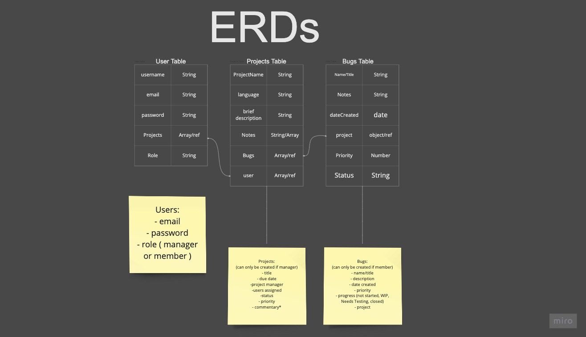
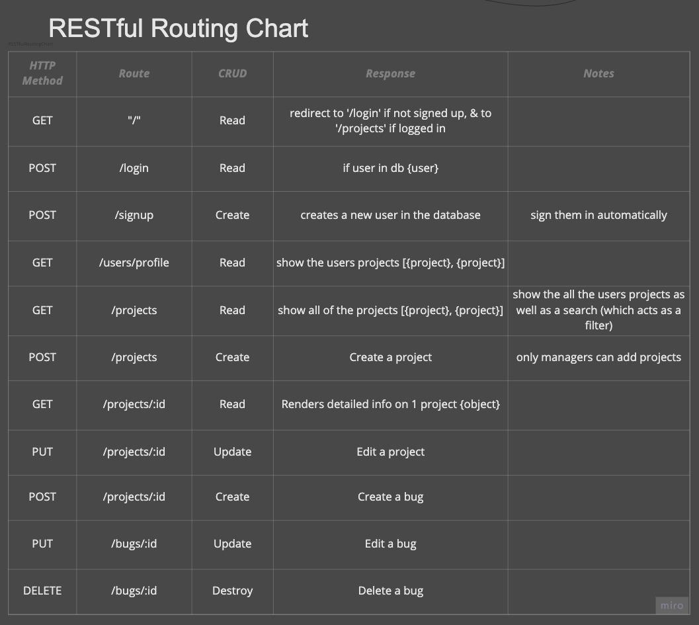
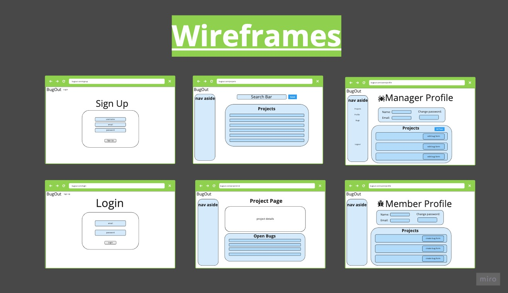

# Bug Out

### Description
#### BugOut is a development project and bug management system. Users will be able to submit, track and resolve issues easily. Bugs can be created with different priority levels and have its working status changed as the issue becomes resolved. Projects can have a feed of issues with team commentary. Users will be able to sign up as managers or members, each with different permissions.
---

---

## ERDs

---

## Restful Routing Chart

---

## Wireframes

---

## User Stories
As a user:
- I want to sign up as a manager or member
- I want log in and see all projects in the tracker
- I want to be authorized to manager roles or member roles
- As a manager, I want to create projects and be able to close bugs
- As a member, I want to create bugs and update statuses

- On my manager profile, I want to see my own projects with a form to add new ones
- On my member profile, I want to see my projects that I am assigned to with a form to add a bug to that project

- I want to be able to stay signed in for a certain duration
- I want to be able to log out
---

## MVP Goals
- a login page with authentication methods 
- authorized page views based on login credentials
- ability to show all projects
- ability to only see 'assigned'/'owned' projects
- ability to add projects if authorized
- ability to add bugs if authorized
- ability to close bugs if authorized
- ability to sort projects and bugs

---

## Stretch Goals
- dark mode
- tailwind styling
- Carousel on /project 